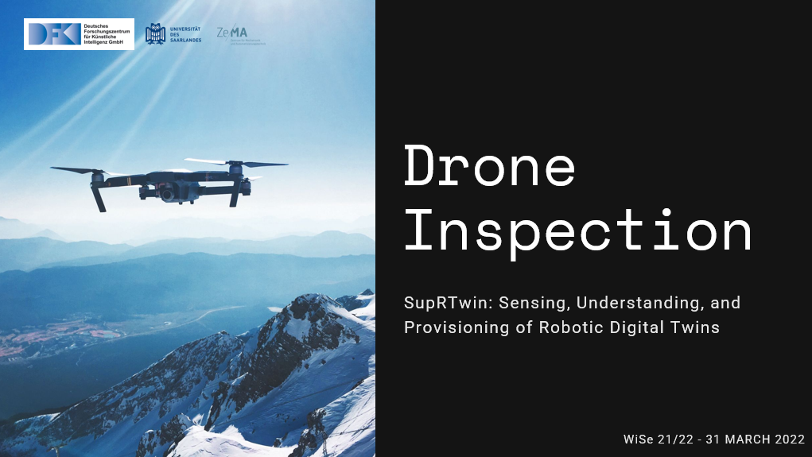

# droneinspection

This project was created as part of a Seminar - SupRTwin: Sensing, Understanding, and Provisioning of Robotic Digital Twins from Universitat Des Saarlandes

Original Repository: https://mrk40.dfki.de/drone-inspection-seminar/droneinspection

## Introduction
This repository contains the presentation files used for the final seminar presentation and some set of Experiment data.

The end to end flow looks like:

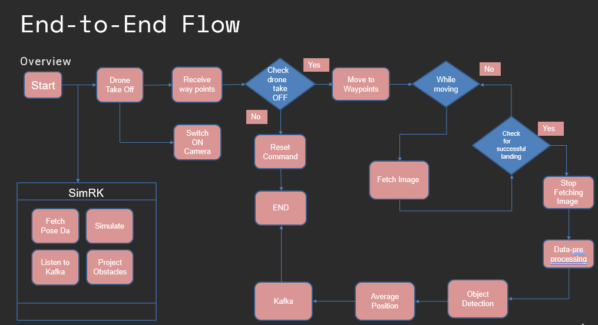
### MQTT Drone API
The drone uses [MQTT Protocol](https://mqtt.org/) to communicate. In short, the following topics are of our interest 
- Mavic2/state/pose - Pose information obtained from markers of drone using a Motion Capture system (OptiTrack system) and published to MQTT through [Motive App](https://optitrack.com/software/motive/)
- Mavic2/state/physical - Current Physical State obtained using [DJI SDK](https://developer.dji.com/mobile-sdk-v4/) and [Android dronecontrol app](https://mrk40.dfki.de/mrk-4.0/androiddronecontrol)

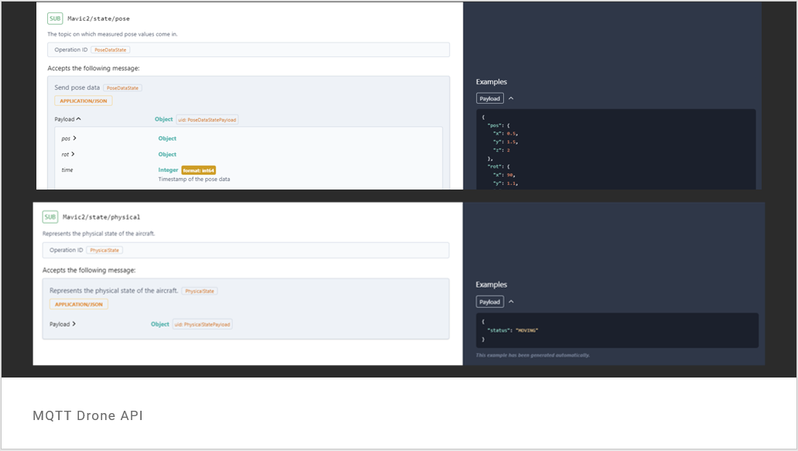

### Drone Live Monitoring
The drone can be monitored live and inputs such as waypoints and certain commands such as starting live image can be provided to the drone through the Live Monitoring Web App.

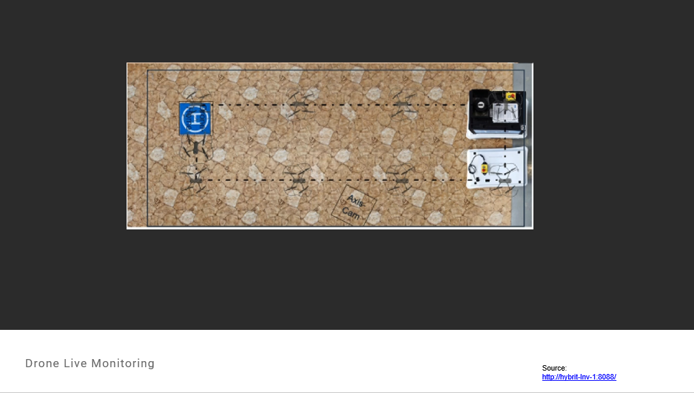

### Drone Inspection Service API
- The project involves creation of two main services - Inspection Flight and Object Detection. They are created using [Flask-RestX](https://flask-restx.readthedocs.io/en/latest/).

### Drone Object Detection
- We use custom trained [YoloV5](https://github.com/ultralytics/yolov5) model to detect the objects

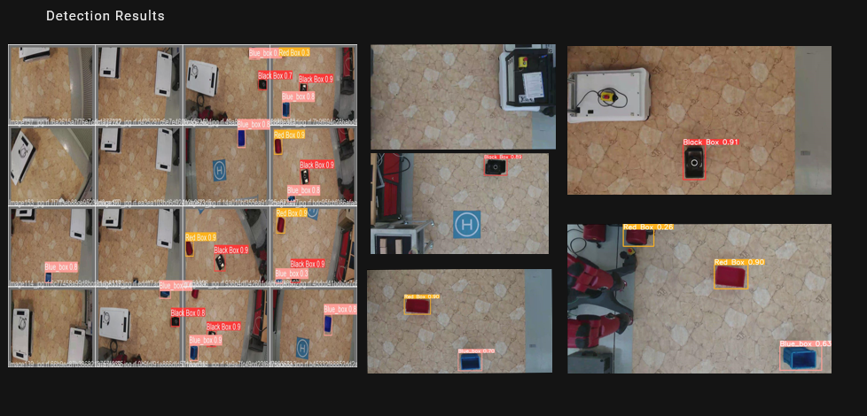

### Pose Estimation
- We use inverse Homography technique to estimate the pose of the objects detected.
- The flow of the pose estimation is given below

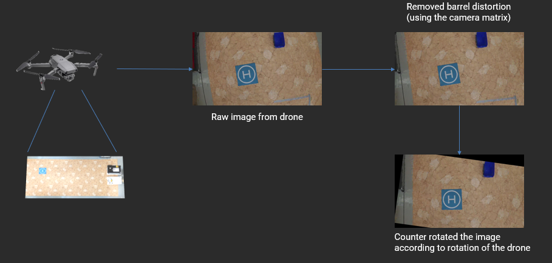
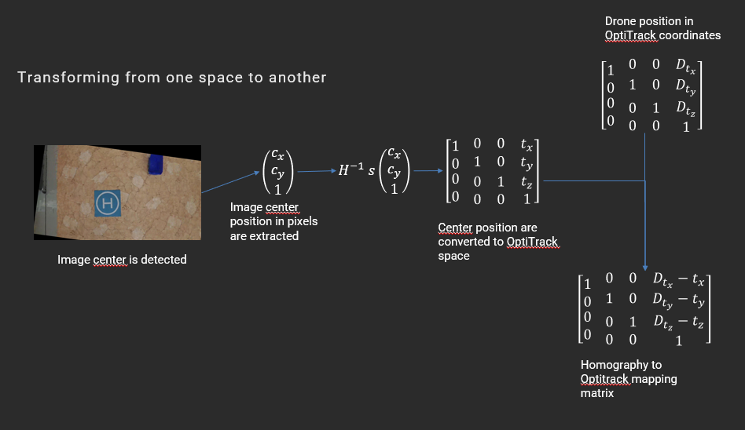
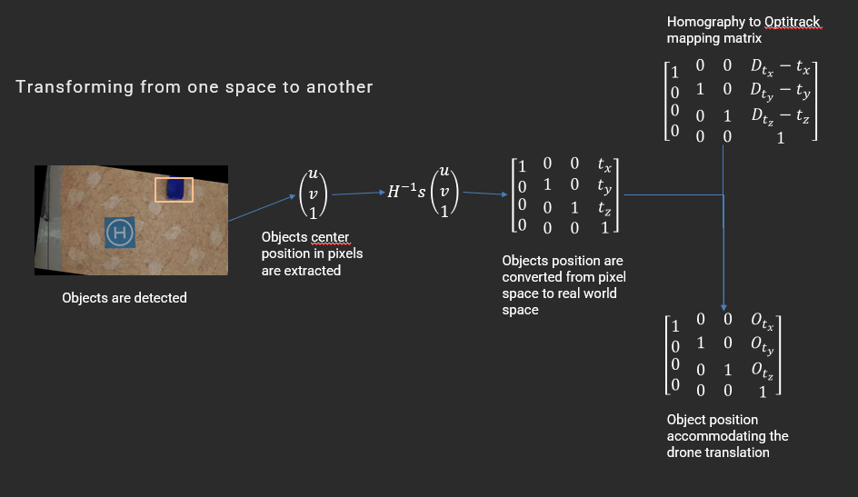
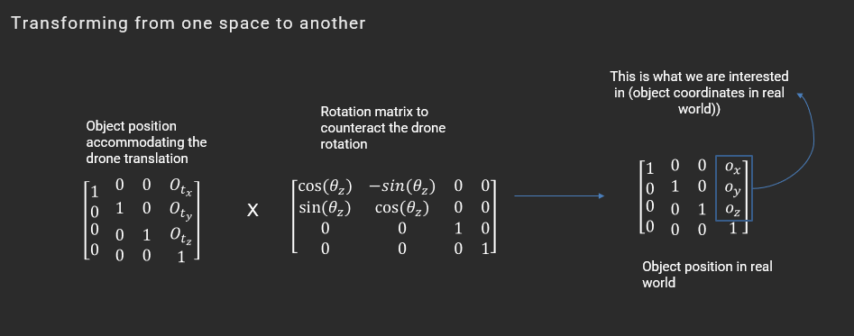

### Process Control and States

- The process control is done with the help of Camunda Process Model and [PackML](https://www.omac.org/packml) standard is used to maintain robotic states across the PPR Dashboard along with other robots.
- The states can be monitored in PPR Dashboard or using [OPC UA Client](https://opcfoundation.org/about/opc-technologies/opc-ua/).
- The [PPR Dashboard](https://github.com/dfkibasys/ppr-dashboard) is a part of the BaSys project which looks like the one below
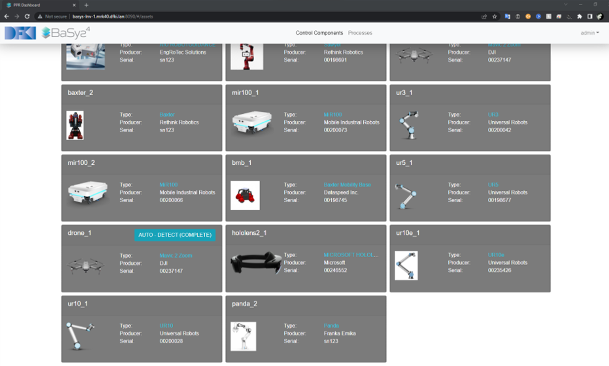

### Simulation
- The digital twin of the detected object is then visualized using simulation framework - SiMRK

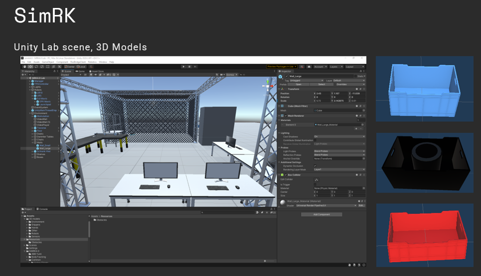

### Tech Stack : 

[//]: # (![Basys]&#40;https://www.ifak.eu/sites/default/files/BaSys4_2.png&#41;)

